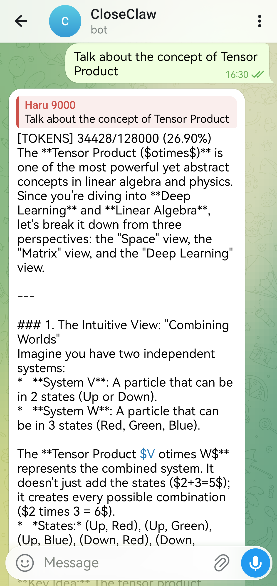
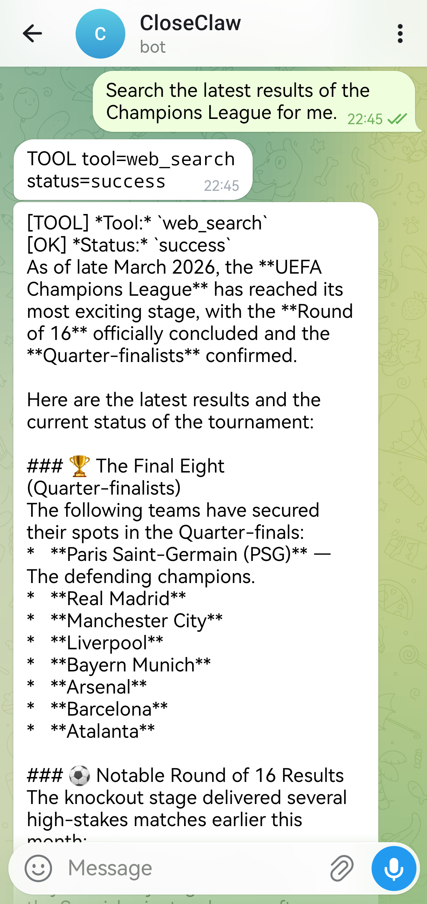
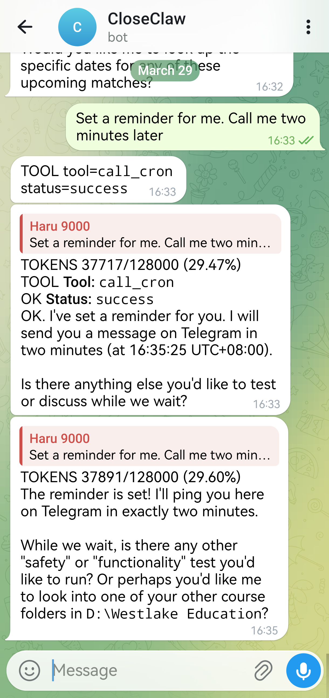

<p align="center">
  
</p>

## 欢迎贡献一份力！

[English](README.md) | [简体中文](README_zh.md)

<p align="center">
  <h1>轻量 • 安全 • 实用 Agent 助理</h1>
</p>

<p align="center">
  
  
  
  
</p>

> 🔥 **CloseClaw** 是一个轻量、安全优先且实用的 OpenClaw 风格 Python 框架。它可作为本地与多通道自动化的个人 Agent，内置安全护栏、任务调度与记忆能力。

---

# 📷 效果预览

<p align="center">
  <table>
    <tr>
      <td align="center" width="33%"><strong> 📚 专业的学习帮助者</td>
      <td align="center" width="33%"><strong> ⏰ 24/7 随时在线的新闻收集者</td>
      <td align="center" width="33%"><strong> 🔜 随叫随到的私人生活助理</td>
    </tr>
    <tr>
      <td align="center"></td>
      <td align="center"></td>
      <td align="center"></td>
    </tr>
  </table>
</p>

---

# 🤔 为什么选择 CloseClaw

- ## ⚡ **部署快**
- 轻量、易部署，带有受保护的编排 Loop，兼顾性能与稳定。个人强大 AI Agent，分钟级启动。

- ## 🧠 **结构化记忆管理**
- 完整且结构化的记忆管理系统，包含长期记忆构建与向量化语义检索，清晰记录每日会话内容与每一个重大决定。长期记忆可持续，认知行为可定制。

- ## 🛡️ **坚实安全保障**
- 清晰严格的沙箱权限体系，包含 Guardian Agent 审核行为机制与轻量化的 Windows 操作系统级别权限沙箱，降低高风险误操作。不必再担忧 Agent删光你的文件夹和邮箱。

- ## 💓 **定时主动执行**
- 配备了 Heartbeat 和 Cron 服务以支持处理任何定时任务，并且周期性苏醒自动处理长期复杂任务。积极主动的个人 Agent，常常与你相伴。

- ## 🔌 **MCP 可扩展**
- 原生支持 MCP 扩展，兼容 OpenClaw 生态技能与工具，便于快速武装 Agent 能力。广阔的工具生态。极易上手升级。

---

# ✨ 主要特征

> [!IMPORTANT]
> **Guardian 机制** 传统沙盒主要保护本地文件；CloseClaw 的 Guardian Agent 还会保护联网资产（邮箱、云端代码仓库、第三方 API）以及所有 MCP 可触达内容。

### 👮 Guardian 监护式设计
- Guardian Agent 智能审核并且在执行前拦截高影响的联网操作。
- MCP/网络工具统一纳入同一安全策略。

### 🔒 Consensus 模式 = 更安全的自动化
- 在 `consensus` 模式下，Guardian Agent 会优先自动审查敏感调用。
- 在保持严格控制的同时，显著降低持续人工审批负担。

### 🧱 坚实的本地防线
- `PathSandbox` 在 `workspace_root` 内提供本地硬边界。
- 在工具执行前拦截路径穿越和越界写入。


### 🪟 OS 级超轻量沙盒
- 对受保护工具（默认：`shell`）启用 OS 级受限执行（restricted token + low integrity + job object 约束）。
- 即使 prompt 层或 Guardian 出现误判，也有系统权限边界兜底。
- 默认保持轻量：仅 `os_sandbox_protected_tools` 名单内工具承担隔离开销；低风险工具（如 `read_file`）继续走快速路径。
- 支持失败闭锁：`os_sandbox_fail_closed: true` 时，沙盒后端不可用将直接阻断执行。

```text
Tool Call
  -> SafetyGuard
  -> PathSandbox
  -> Guardian/Auth 
  -> OS-Level Sandbox
  -> Execute
```

---

## 📡 通道支持

| 通道 | 定位 | 启动提示 |
| --- | --- | --- |
| `CLI` | 💻 本地优先，轻量快速，适合命令行工作流 | 本地交互终端 |
| `Telegram` | ✈️ 移动端指挥中心，安全且响应快（推荐） | 显示 polling 已启动 |
| `Feishu / Lark` | 🏢 企业协作场景的专业集成 | 打印 webhook 地址（host/port） |
| `Discord` | 🎮 社区协作场景，支持丰富 markdown 交互 | 显示 gateway 已启动 |
| `Whatsapp`| 🟢 通过 bridge 触达受限网络环境下的移动端 | 打印 bridge URL |
| `QQ` | 🐧 面向中文生态的即时通信入口 | 显示 gateway 已启动 |

WhatsApp bridge 协议说明：
- [docs/WhatsApp_Bridge_Protocol.md](docs/WhatsApp_Bridge_Protocol.md)

---

## 🤖 LLM Provider 支持

| Provider | 运行路径 | 说明 |
| --- | --- | --- |
| `openai` / `openai-compatible` | 原生 provider 路径 | 默认友好，开箱即用 |
| `gemini` | LiteLLM runtime | 需要安装 `.[providers]` 可选依赖 |
| `anthropic` | LiteLLM runtime | 需要安装 `.[providers]` 可选依赖 |
| `ollama` | 本地独立 provider runtime | 适合本地模型开发与调试 |

---

# 🚀 快速开始

### 1) 安装

```bash
git clone https://github.com/closeclaw/closeclaw.git
cd closeclaw
pip install -e .
```

可选依赖：

```bash
pip install -e ".[telegram]"
pip install -e ".[discord]"
pip install -e ".[whatsapp]"
pip install -e ".[qq]"
pip install -e ".[fastapi]"
pip install -e ".[providers]"
```

> 📝 `.[providers]` 会安装 `litellm`，是 `gemini` 和 `anthropic` provider 所需依赖。

### 2) 生成配置

```bash
cp config.example.yaml config.yaml
```

最小配置示例：

```yaml
agent_id: "closeclaw-main"
workspace_root: "your/workspace"

llm:
  provider: "openai-compatible"
  model: "gpt-4"
  api_key: "sk-..."
  base_url: "https://api.openai.com/v1"

channels:
  - type: "cli"
    enabled: true

safety:
  admin_user_ids: ["cli_user"]
  default_need_auth: false
```

### 3) 运行

Agent 模式（仅 CLI）：

```bash
closeclaw agent --config config.yaml
```

Gateway 模式：

```bash
closeclaw gateway --config config.yaml
```

### ✨这就是你的私人 Agent！

---

## 🐳 Docker（可选）

Docker 支持是可选路径。若你希望依赖更可复现、部署更一致，建议按本节执行。

### 1) 一次性准备（直接复制）

macOS/Linux：

```bash
cp .env.example .env
cp config.example.yaml config.yaml
mkdir -p workspace runtime-data
```

Windows PowerShell：

```powershell
Copy-Item .env.example .env
Copy-Item config.example.yaml config.yaml
New-Item -ItemType Directory -Force -Path workspace, runtime-data
```

### 2) 最小配置检查

请确保 `config.yaml` 满足：

- `workspace_root: "/workspace"`（Linux 容器必须）
- 目标模式至少有一个可用通道：
  - `agent` 模式：可启用 `cli`
  - `gateway` 模式：必须启用至少一个非 CLI 通道
- `.env` 的 `INSTALL_EXTRAS` 包含对应依赖
  - 例如 Telegram 网关：`INSTALL_EXTRAS=[providers,telegram]`

### 3) 构建并启动（推荐 compose）

```bash
docker compose build
docker compose up -d closeclaw-gateway
docker compose ps
docker compose logs -f closeclaw-gateway
```

### 4) 健康检查（重点）

Gateway 容器健康检查：

```bash
docker compose exec closeclaw-gateway closeclaw runtime-health --config /app/config.yaml --mode gateway --json
```

CLI profile 健康检查：

```bash
docker compose run --rm closeclaw-cli runtime-health --config /app/config.yaml --mode agent --json
```

期望结果：

- 返回码为 `0`
- JSON 中包含 `"healthy": true`

### 5) 常见报错与修复

- `workspace_root does not exist: /app/D:`
  - 原因：容器里用了 Windows 路径。
  - 修复：改为 `workspace_root: "/workspace"`。
- `No channels enabled for mode=gateway`
  - 原因：gateway 模式下只启用了 CLI。
  - 修复：至少启用一个非 CLI 通道。
- `python-telegram-bot is required`
  - 原因：镜像未安装 telegram 依赖。
  - 修复：`.env` 设置 `INSTALL_EXTRAS=[providers,telegram]` 后重建。
- `docker compose run --rm closeclaw-cli closeclaw ...` 报参数错误
  - 原因：重复写了 `closeclaw`。
  - 修复：改为 `docker compose run --rm closeclaw-cli runtime-health ...`。

### 6) 停止与清理

```bash
docker compose down
```

### 7) 可选：一键 smoke 测试

使用 Bash 运行：

```bash
bash tests/test_docker.sh
```

在 PowerShell 中请显式调用 Bash：

```powershell
bash tests/test_docker.sh
```

生产化建议与硬化细节见 [docs/Docker_Runbook.md](docs/Docker_Runbook.md)。

---

## 🎯 运行模式

| 模式 | 实际运行内容 | 典型用途 |
|---|---|---|
| `agent` | 仅 CLI | 本地交互调试 / 开发 |
| `gateway` | 仅非 CLI 通道 | Bot 网关部署 |
| `all` | CLI + 所有启用通道 | 本地全链路联调 |

---

## 🧱 架构总览

```text
closeclaw/
├─ runner.py                              # 运行时入口 + channel/heartbeat/cron 编排
├─ agents/
│  └─ core.py                             # AgentCore：主编排循环与执行生命周期
├─ services/
│  ├─ tool_execution_service.py           # 工具路由 + 中间件 + 授权处理
│  └─ context_service.py                  # 上下文整形、压缩与窗口管理
├─ memory/
│  └─ memory_manager.py                   # 记忆检索与持久化协调
├─ channels/                              # CLI / Telegram / Feishu / Discord / WhatsApp / QQ 适配器
├─ tools/                                 # 文件 / Shell / Web / 调度 / 记忆辅助工具
└─ mcp/                                   # MCP 传输层、连接池、桥接与健康检查
```

### 核心职责
- `runner`：启动编排（channels、heartbeat、cron、agent 生命周期）
- `AgentCore`：主编排循环 + 工具决策与执行流
- `ToolExecutionService`：工具路由、中间件、授权交互
- `ContextService`：上下文整形与压缩策略
- `MemoryManager`：记忆检索与持久化层

### 主要模块
- `closeclaw/runner.py`
- `closeclaw/agents/core.py`
- `closeclaw/services/tool_execution_service.py`
- `closeclaw/services/context_service.py`
- `closeclaw/memory/memory_manager.py`

---

## 🔐 安全模型

CloseClaw 采用分层安全控制：

1. ✅ **人工授权**
   - 标记为 `need_auth=True` 的工具需要显式审批。
2. ✅ **工作区沙箱**
   - 文件路径会标准化并限制在 `workspace_root` 内。
3. ✅ **命令黑名单**
   - 高风险 shell 模式在执行前被拦截。
4. ✅ **审计日志**
   - 运行行为记录到 `safety.audit_log_path`。

---

## 🧰 内置工具

工具分组：
- 📁 文件工具：read/write/edit/delete/list/exists/size/line-range
- 🖥️ Shell 工具：shell 执行 + pwd
- 🌍 Web 工具：web_search + fetch_url
- ⏲️ 调度工具：call_cron
- 🧠 记忆工具：write/edit memory file

Web 搜索行为：
- 当前 provider 为 Brave Search API
- 默认关闭，需配置 `web_search.enabled=true` 及 API key

---

## ⚙️ 配置参考

### `llm`
关键字段：`provider`、`model`、`api_key`、`base_url`、`temperature`、`max_tokens`、`timeout_seconds`

Gemini 示例：

```yaml
llm:
  provider: "gemini"
  model: "gemini-2.5-flash"
  api_key: "YOUR_GEMINI_API_KEY"
  temperature: 0.2
  max_tokens: 4096
```

Anthropic 示例：

```yaml
llm:
  provider: "anthropic"
  model: "claude-3-7-sonnet"
  api_key: "YOUR_ANTHROPIC_API_KEY"
  temperature: 0.2
  max_tokens: 4096
```

Ollama 本地示例：

```yaml
llm:
  provider: "ollama"
  model: "llama3.1"
  api_key: ""
  base_url: "http://localhost:11434"
  temperature: 0.0
  max_tokens: 4096
```

### `web_search`

```yaml
web_search:
  enabled: false
  provider: "brave"
  brave_api_key: "BSA-..."
  timeout_seconds: 30
```

### 其他高影响配置块
- `safety`：管理员、默认授权、黑名单、审计配置
- `context_management`：token 窗口、阈值、保留策略
- `orchestrator`：步数、墙钟时长、无进展阈值
- `heartbeat`：间隔、静默时段、队列保护、路由
- `cron`：存储路径、时区、启停控制

### `Memory and Soul`（工作区个性化）

首次运行后，进入工作区本地目录：

```text
<workspace_root>/CloseClaw Memory/
```

可通过编辑以下文件个性化运行时行为：
- `AGENTS.md`：Agent 策略/人格与协作偏好
- `SOUL.md`：长期身份、语气与行为风格
- `USER.md`：用户偏好与约束
- `TOOLS.md`：工具使用约定与边界
- `SKILLS.md`：技能级指导与触发约定
- `HEARTBEAT.md`：周期性主动行为指令
- `memory/YYYY-MM-DD.md`：日级记忆笔记与上下文快照

建议：
- 规则尽量简洁、明确、避免冲突。
- 稳定人格规则放 `SOUL.md`，任务临时指导放每日 `memory/`。
- 行为漂移时，先检查 `AGENTS.md` + `SOUL.md`，再清理冲突笔记。

---

## 📦 MCP 配置教程

CloseClaw 当前支持：
- MCP server 健康诊断
- 通过 `MCPBridge` 投影 MCP 工具

### 第 0 步：规划服务目录

```text
<repo-root>/
  mcp_servers/
    weather_server/
    docs_server/
```

### 第 1 步：准备服务
- 仓库内 Python MCP 服务，或
- 使用 `npx` / `npx.cmd` 运行 npm 托管服务

### 第 2 步：配置 `config.yaml`

```yaml
mcp:
  servers:
    - id: "local-stdio"
      transport: "stdio"
      command: "python"
      args: ["-m", "your_mcp_server"]
      timeout_seconds: 30

    - id: "remote-http"
      transport: "http"
      base_url: "https://example.com"
      endpoint: "/mcp"
      timeout_seconds: 15
      max_retries: 2
      retry_backoff_seconds: 0.2
```

### 第 3 步：健康检查

```bash
closeclaw mcp --config config.yaml
closeclaw mcp --config config.yaml --json
```

### 第 4 步：启动运行时

```bash
closeclaw agent --config config.yaml
```

> ✅ Runner 会自动加载 MCP 服务并将工具 schema 同步到运行时。

### 第 5 步：快速排错
- stdio 不健康：手工验证 command 与 args
- http 不健康：检查 base_url + endpoint 可达性
- 配置未生效：确认实际传入的 `--config` 文件一致
- 工具未被选中：检查 bootstrap 流程与工具名冲突

---

## 🧠 Memory 目录结构

```text
<workspace_root>/
  CloseClaw Memory/
    state.json
    audit.log
    memory.sqlite
    HEARTBEAT.md
    MEMORY.md
    AGENTS.md
    SOUL.md
    USER.md
    TOOLS.md
    SKILLS.md
    memory/
      YYYY-MM-DD.md
```

采用该布局的原因：
- 运行产物与源码目录解耦
- 备份与迁移更简单
- 支持从历史分散路径平滑升级

---

## 🧪 测试

聚焦测试：

```bash
python -m pytest tests/test_config.py -q
python -m pytest tests/test_tools.py tests/test_tool_execution_service.py -q
python -m pytest tests/test_runner.py tests/test_heartbeat_service.py tests/test_cron_service.py -q
```

全量测试：

```bash
python -m pytest tests -q
```

---

## 🔁 迁移说明

当前兼容行为包括：
- 旧 `state.json` 自动升级到 `CloseClaw Memory/state.json`
- 旧 `phase5` 配置键映射到 `orchestrator`
- 记忆产物可迁移到统一目录结构

---

## 🩺 故障排查

1. Web 搜索提示缺少 key
- 设置 `web_search.enabled=true`
- 设置 `web_search.provider=brave`
- 设置有效 `web_search.brave_api_key`

2. 工具调用意外要求审批
- 检查 `safety.default_need_auth`
- 检查工具级 `need_auth` 标注

3. Heartbeat 未触发
- 检查 `heartbeat.enabled`
- 检查 `CloseClaw Memory/HEARTBEAT.md`
- 检查 quiet-hours 与 queue guard 配置

4. Cron 未生效
- 检查 `cron.enabled`
- 检查 `cron.store_file` 写权限
- 使用 cron list/run-now 命令诊断

🪟 Windows 入口命令未识别

如果 PowerShell 提示找不到 `closeclaw`：

1. 先激活虚拟环境。
2. 重新执行可编辑安装，生成脚本入口。
3. 回退到模块模式运行。

```powershell
pip install -e .
python -m closeclaw agent --config config.yaml
Get-Command closeclaw
```

> ℹ️ 若 `Get-Command closeclaw` 无输出，说明当前 shell 的 PATH 未包含该入口脚本。

---

## 🤝 Contributing Guide

欢迎贡献，任何改进都非常有价值。

### 1) Fork 并创建功能分支

```bash
git checkout -b feat/your-change-name
```

### 2) 提交 PR 前先本地跑测试

聚焦测试：

```bash
python -m pytest tests/test_config.py -q
python -m pytest tests/test_tools.py tests/test_tool_execution_service.py -q
python -m pytest tests/test_runner.py tests/test_heartbeat_service.py tests/test_cron_service.py -q
```

全量测试：

```bash
python -m pytest tests -q
```

### 3) 提交 Pull Request

请包含：
- 清晰的问题描述与改动范围
- 改动内容与设计理由
- 测试证据（命令与结果）
- 若有行为/配置变更，附迁移说明

### 4) 当前重点欢迎的贡献方向

- 🐞 bug 发现、issue 提交与直接修复
- 🧪 channel/provider/integration 路径的测试覆盖增强
- 🪟🍎 跨平台稳定性提升（包括 macOS 兼容性改进）
- 📚 文档清晰度、上手体验与示例改进

### 5) 高质量 issue 建议

提交 bug 时建议附带：
- 运行命令与完整错误输出
- 可复现的最小配置（注意脱敏）
- 环境信息（OS、Python 版本、可选依赖安装情况）

感谢你帮助 CloseClaw 变得更好。

---

<p align="center">
  <b>CloseClaw：小而强，严谨防护，面向真实自动化。</b>
</p>


